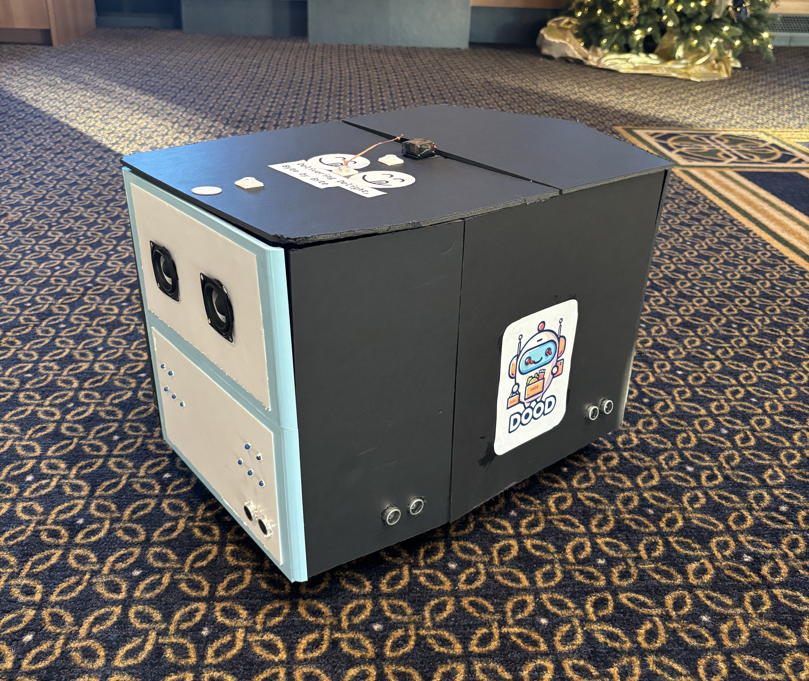
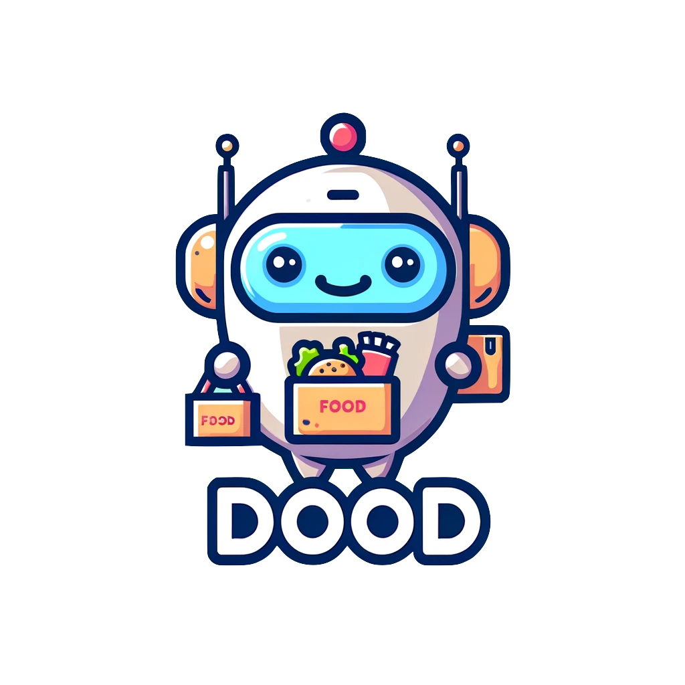
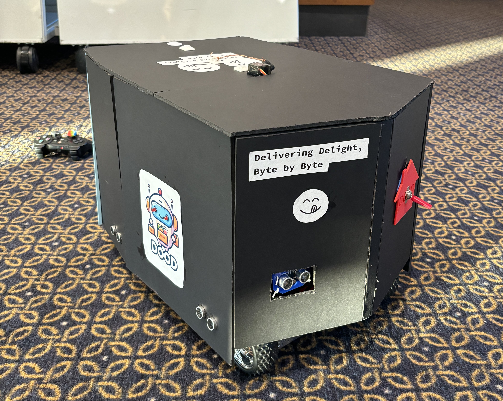

# D00D - The Food Delivery Droid
### "Delivery Delight, Byte by Byte"

  
  
  

## Introduction to Droid Building (CSE 40883) - University of Notre Dame

Welcome to the repository for D00D, a mid-size, full-motion food delivery droid designed and constructed for the course "Introduction to Droid Building" at the University of Notre Dame. This project showcases our skills in 3D printing, CAD, Arduino programming, and more, culminating in a functional and interactive droid.

### Course Description
In this course, we embarked on creating a student-designed droid, inspired by popular Sci-Fi movies. Our journey involved:

- 3D Printing & CAD Design
- Motion Control Systems
- Electrical Circuitry
- Sound & Lighting Systems
- Communication Protocols (Serial, I2C, Bluetooth)
- Arduino Programming

## Project Overview

### Concept and Design
Our project, D00D, is a food delivery droid. Its unique design includes a custom logo and a structure combining 3D printed elements and foam board.

### Technical Specifications
- **Frame**: 3D printed front, foam board structure
- **Battery**: Long-lasting, integrated power system
- **Lights**: 12 LED lights for navigation and signaling
- **Sound System**: Dual speakers with an integrated soundboard
- **Sensors**: Four sonar sensors for navigation
- **Mobility**: Three-wheel design with a multidirectional front wheel
- **Storage**: Three-tiered internal structure

#### Internal Layout
- **First Floor**: Battery, fuse block, motors and motor controller, Arduino MEGA ADK
- **Second Floor**: Sound system (amplifier, speakers, soundboard), LED control
- **Third Floor**: Food storage with servo motor-operated lid

### Features and Functionalities
- **Auto-Pilot Mode**: Autonomous navigation using sonar sensors
- **Manual Control**: PS3 controller joystick operated driving, with ambient sound and music
- **Routine Operations**:
  - Delivery signaling with LED and sound effects
  - Food pickup indication with audio-visual cues
  - Interaction routine for path obstructions

[**Path Obstruction Routine Video**](https://github.com/gelbling/D00D/blob/master/imgs/please_move.MOV)

[**Delivery Pickup Routine**](https://github.com/gelbling/D00D/blob/master/imgs/please_move.MOV)

### Code and Control
- **Programming Language**: C++
- **Control Board**: Arduino MEGA ADK
- **Functionalities**:
  - Autonomous and manual navigation
  - Interactive routines for delivery and user engagement

### NFC Tag Integration
- **Usage**: Confirmation and rating of deliveries, simply tap smartphone on the tag
- **Placement**: On the top lid for easy access

## Gallery
Include a series of images showcasing your droid in various stages of construction, operation, and in action.

## Conclusion
D00D represents a culmination of our skills in robotics, programming, and engineering. This project not only demonstrates our technical abilities but also our creativity and problem-solving skills in real-world applications.

---

For inquiries or further information, feel free to contact us.

[Gabriel's Personal Website](https://gelbling.github.io/)
